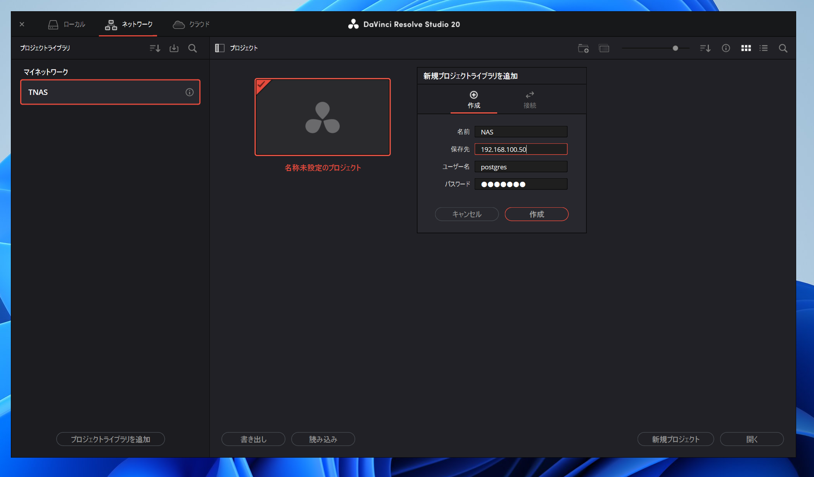

# Davinci Resolve Project Server (Terramaster/NAS 向け)

## 概要

- Docker で動く Resolve プロジェクトサーバー。PostgreSQL 13 と自動バックアップの最小構成。
- NAS 向けに macvlan 前提の `docker-compose.yml` に統一。
- サンプル値は環境のインターフェース/サブネット/ゲートウェイ/固定 IP に置き換えて使用。
- オリジナル: <https://github.com/elliotmatson/Docker-Davinci-Resolve-Project-Server>

## オリジナルからの主な変更

- PGAdmin とヘルパーコンテナを削除（軽量化）
- macvlan 設定をデフォルト採用
- GitHub Actions / CI を削除（macvlan が CI で使用不可のため）

## 前提

- TerraMaster製 NAS（Docker Manager利用可能なモデル）  
  ※ F4-425 Plus で動作確認済み
- 固定IP が未使用であること
- macvlan がネットワークで使用可能であること

## 使い方

1. `docker-compose.yml` の変数を環境に合わせる。
   - `RESOLVE_MACVLAN_PARENT` 例: `eth0`
   - `RESOLVE_MACVLAN_SUBNET` 例: `192.168.100.0/24`
   - `RESOLVE_MACVLAN_GATEWAY` 例: `192.168.100.1`
   - `RESOLVE_PG_IP` 例: `192.168.100.50`（未使用の固定 IP）
   - `POSTGRES_LOCATION` 例: `/nasのフォルダパス:/var/lib/postgresql/data`
   - `BACKUP_LOCATION` 例: `/nasのフォルダパス/...:/backups`

> [!NOTE]
> macvlan : ネットワーク設定、設定必須。  
> database : DB へのログイン情報。セキュリティ的に変更推奨。  
> backup : バックアップ頻度は好みに合わせてどうぞ。  
> POSTGRES_LOCATION は SSD 推奨。設定したフォルダパスにフォルダが存在しないと起動時にエラーになります。


   ```yaml
   macvlan: &macvlan-environment
     RESOLVE_MACVLAN_PARENT: &macvlan-parent "eth0"
     RESOLVE_MACVLAN_SUBNET: &macvlan-subnet "192.168.100.0/24"
     RESOLVE_MACVLAN_GATEWAY: &macvlan-gateway "192.168.100.1"
     RESOLVE_PG_IP: &pg-ip "192.168.100.50"
   database: &db-environment
     POSTGRES_DB: &pg-db databases
     POSTGRES_USER: &pg-user postgres
     POSTGRES_PASSWORD: DaVinci
     TZ: Asia/Tokyo
     POSTGRES_LOCATION: &db-location "/Volume1/Docker/Resolve_DB:/var/lib/postgresql/data"
   backup: &backup-environment
     SCHEDULE: "@daily"
     BACKUP_KEEP_DAYS: 7
     BACKUP_KEEP_WEEKS: 4
     BACKUP_KEEP_MONTHS: 6
     BACKUP_KEEP_MINS: 0
     BACKUP_LOCATION: &bk-location "/Volume2/project_backup/backups:/backups"
   ```

2. DockerManagerを開き、変更したymlファイルの中身をコピペ  
   
3. Davinciを開きネットワークタブからプロジェクトライブラリを追加を選択。先ほど設定した情報を入力  
   

## 設定項目詳細

- ネットワーク（macvlan）

| 変数 | 例 | 説明 |
| --- | --- | --- |
| RESOLVE_MACVLAN_PARENT | eth0 | LAN1がeth0、LAN2がeth1 のはず |
| RESOLVE_MACVLAN_SUBNET | 192.168.100.0/24 | コンテナ用サブネット |
| RESOLVE_MACVLAN_GATEWAY | 192.168.100.1 | サブネットのゲートウェイ |
| RESOLVE_PG_IP | 192.168.100.50 | PostgreSQL コンテナに割り当てる適当な固定IP（未使用のもの） |

- PostgreSQL (database)

| 変数 | 例 | 説明 |
| --- | --- | --- |
| POSTGRES_DB | database | 作成するデータベース名 |
| POSTGRES_USER | postgres | 接続ユーザー名（Resolve デフォルト） |
| POSTGRES_PASSWORD | DaVinci | 接続パスワード（Resolve デフォルト） |
| TZ | Asia/Tokyo | タイムゾーン |
| POSTGRES_LOCATION | /Volume1/...:/var/lib/postgresql/data | DBの保存先（左がホストパス） |

- backup

| 変数 | 例 | 説明 |
| --- | --- | --- |
| SCHEDULE | @daily | 取得間隔（cron 形式） |
| BACKUP_KEEP_DAYS | 7 | 日次バックアップ保持数 |
| BACKUP_KEEP_WEEKS | 4 | 週次バックアップ保持数 |
| BACKUP_KEEP_MONTHS | 6 | 月次バックアップ保持数 |
| BACKUP_KEEP_MINS | 0 | 分単位の保持数（不要なら 0） |
| BACKUP_LOCATION | /Volume2/...:/backups | バックアップ保存先（左がホストパス） |

## LICENSE / CREDITS

This repository remains under the MIT License.  

Credits:

- Original: <https://github.com/elliotmatson/Docker-Davinci-Resolve-Project-Server>
- Backup image: <https://github.com/prodrigestivill/docker-postgres-backup-local>
