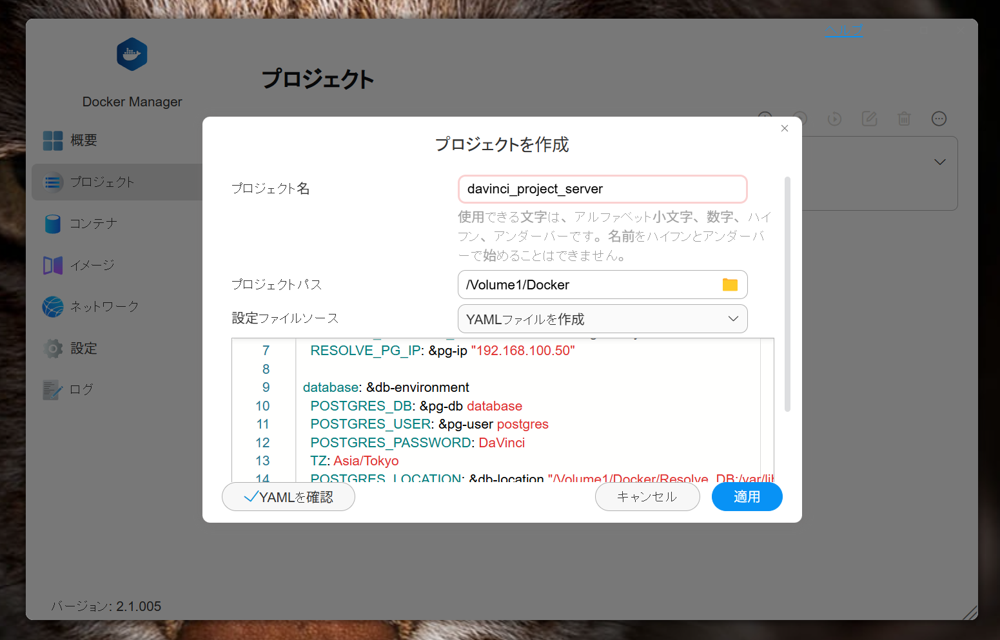
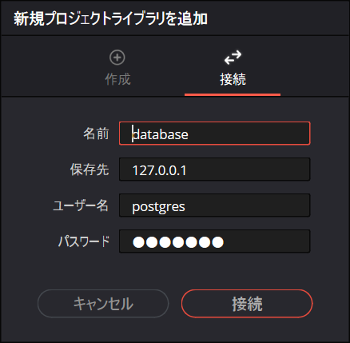

# Davinci Resolve Project Server (Terramaster/NAS 向けフォーク)

## 概要

- Docker で動く Resolve プロジェクトサーバー。PostgreSQL 13 と自動バックアップの最小構成。
- NAS 向けに macvlan 前提の `docker-compose.yml` に統一。
- サンプル値は環境のインターフェース/サブネット/ゲートウェイ/固定 IP に置き換えて使用。
- オリジナル: <https://github.com/elliotmatson/Docker-Davinci-Resolve-Project-Server>

## オリジナルからの主な変更

- PGAdmin とヘルパーコンテナを削除（軽量化）
- macvlan 設定をデフォルト採用
- GitHub Actions / CI を削除（macvlan が CI で使用不可のため）

## 前提

- TerraMaster製 NAS（Docker Manager利用可能なモデル）  
  ※ F4-425 Plus で動作確認済み
- 固定IP が未使用であること
- macvlan がネットワークで使用可能であること

## 使い方

1. `docker-compose.yml` の変数を環境に合わせて書き換える。

   **macvlan（ネットワーク設定・必須）**
   - `RESOLVE_MACVLAN_PARENT` — NASのLANポート名。LAN1なら `eth0`、LAN2なら `eth1`
   - `RESOLVE_MACVLAN_SUBNET` — 自宅ネットワークのサブネット。例: `192.168.1.0/24`
   - `RESOLVE_MACVLAN_GATEWAY` — ルーターのIPアドレス。例: `192.168.1.1`
   - `RESOLVE_PG_IP` — PostgreSQLコンテナに割り当てる固定IP。自宅ネットワーク内で**他のデバイスと被っていない未使用のIP**を指定。例: `192.168.1.50`

   **database（DB設定）**
   - `POSTGRES_PASSWORD` — DBのパスワード。デフォルト `DaVinci` から変更推奨
   - `POSTGRES_LOCATION` — DBデータの保存先。`:`の左がNAS上のパス、右はそのまま。SSD推奨。例: `/volume1/docker/resolve_db:/var/lib/postgresql/data`

   **backup（バックアップ設定）**
   - `BACKUP_LOCATION` — バックアップの保存先。`:`の左がNAS上のパス、右はそのまま。例: `/volume2/backup/resolve:/backups`

   > [!NOTE]
   > `POSTGRES_LOCATION`・`BACKUP_LOCATION` に指定したNAS側のフォルダは**事前に作成しておくこと**。存在しないと起動時にエラーになる。

   ```yaml
   macvlan: &macvlan-environment
     RESOLVE_MACVLAN_PARENT: &macvlan-parent "eth0"
     RESOLVE_MACVLAN_SUBNET: &macvlan-subnet "192.168.1.0/24"
     RESOLVE_MACVLAN_GATEWAY: &macvlan-gateway "192.168.1.1"
     RESOLVE_PG_IP: &pg-ip "192.168.1.50"
   database: &db-environment
     POSTGRES_DB: &pg-db databases
     POSTGRES_USER: &pg-user postgres
     POSTGRES_PASSWORD: your-password
     TZ: Asia/Tokyo
     POSTGRES_LOCATION: &db-location "/volume1/docker/resolve_db:/var/lib/postgresql/data"
   backup: &backup-environment
     SCHEDULE: "@daily"
     BACKUP_KEEP_DAYS: 7
     BACKUP_KEEP_WEEKS: 4
     BACKUP_KEEP_MONTHS: 6
     BACKUP_KEEP_MINS: 0
     BACKUP_LOCATION: &bk-location "/volume2/backup/resolve:/backups"
   ```

2. DockerManagerを開き変更したymlファイルの中身をコピペ  
   
3. Davinciを開きネットワークタブからプロジェクトライブラリを追加を選択。以下の情報を入力  
   

   | Resolve の入力欄 | 入力する値 | yml の設定箇所 |
   | --- | --- | --- |
   | IPアドレス（ホスト） | 例: `192.168.100.50` | `RESOLVE_PG_IP` |
   | データベース名 | 例: `database` | `POSTGRES_DB` |
   | ユーザー名 | 例: `postgres` | `POSTGRES_USER` |
   | パスワード | 例: `DaVinci` | `POSTGRES_PASSWORD` |

## 設定項目詳細

- ネットワーク（macvlan）

| 変数 | 例 | 説明 |
| --- | --- | --- |
| RESOLVE_MACVLAN_PARENT | eth0 | LAN1がeth0、LAN2がeth1 のはず |
| RESOLVE_MACVLAN_SUBNET | 192.168.100.0/24 | コンテナ用サブネット |
| RESOLVE_MACVLAN_GATEWAY | 192.168.100.1 | サブネットのゲートウェイ |
| RESOLVE_PG_IP | 192.168.100.50 | PostgreSQL コンテナに割り当てる適当な固定IP（未使用のもの） |

- PostgreSQL (database)

| 変数 | 例 | 説明 |
| --- | --- | --- |
| POSTGRES_DB | database | 作成するデータベース名 |
| POSTGRES_USER | postgres | 接続ユーザー名（Resolve デフォルト） |
| POSTGRES_PASSWORD | DaVinci | 接続パスワード（Resolve デフォルト） |
| TZ | Asia/Tokyo | タイムゾーン |
| POSTGRES_LOCATION | /Volume1/...:/var/lib/postgresql/data | DBの保存先（左がホストパス） |

- backup

| 変数 | 例 | 説明 |
| --- | --- | --- |
| SCHEDULE | @daily | 取得間隔（cron 形式） |
| BACKUP_KEEP_DAYS | 7 | 日次バックアップ保持数 |
| BACKUP_KEEP_WEEKS | 4 | 週次バックアップ保持数 |
| BACKUP_KEEP_MONTHS | 6 | 月次バックアップ保持数 |
| BACKUP_KEEP_MINS | 0 | 分単位の保持数（不要なら 0） |
| BACKUP_LOCATION | /Volume2/...:/backups | バックアップ保存先（左がホストパス） |

## LICENSE / CREDITS

This repository remains under the MIT License.  

Credits:

- Original: <https://github.com/elliotmatson/Docker-Davinci-Resolve-Project-Server>
- Backup image: <https://github.com/prodrigestivill/docker-postgres-backup-local>
